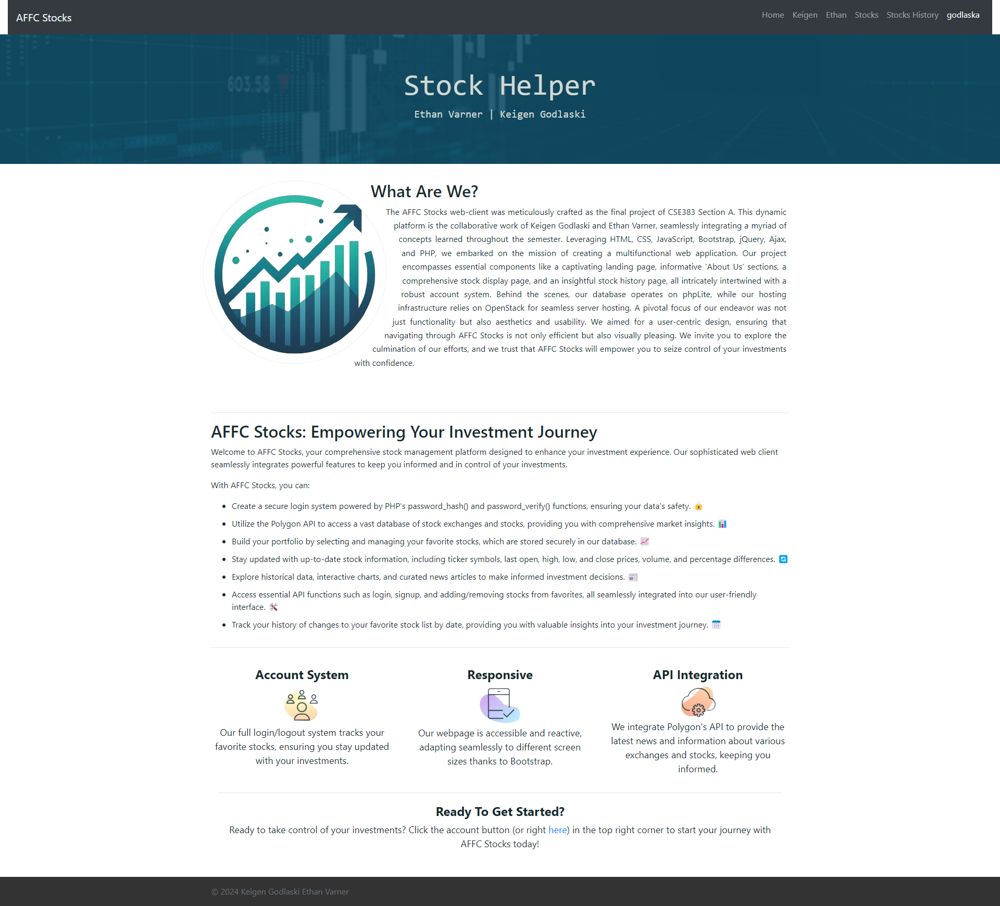
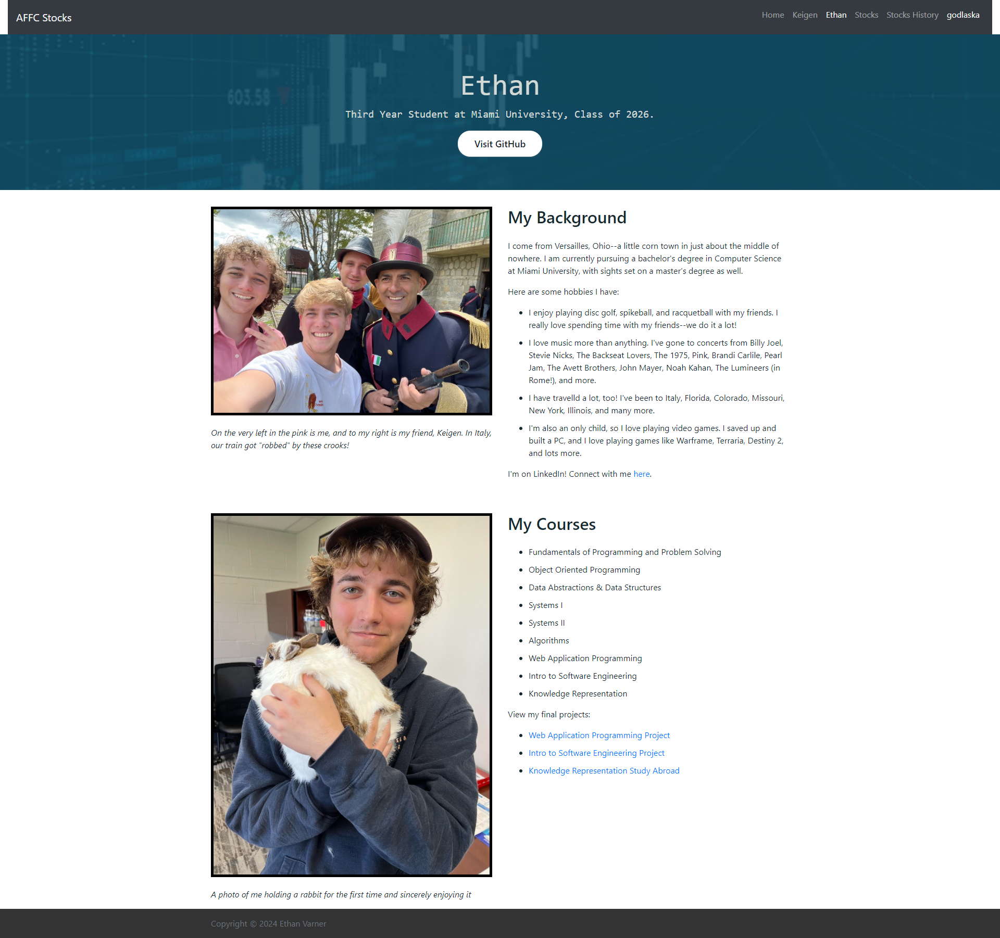
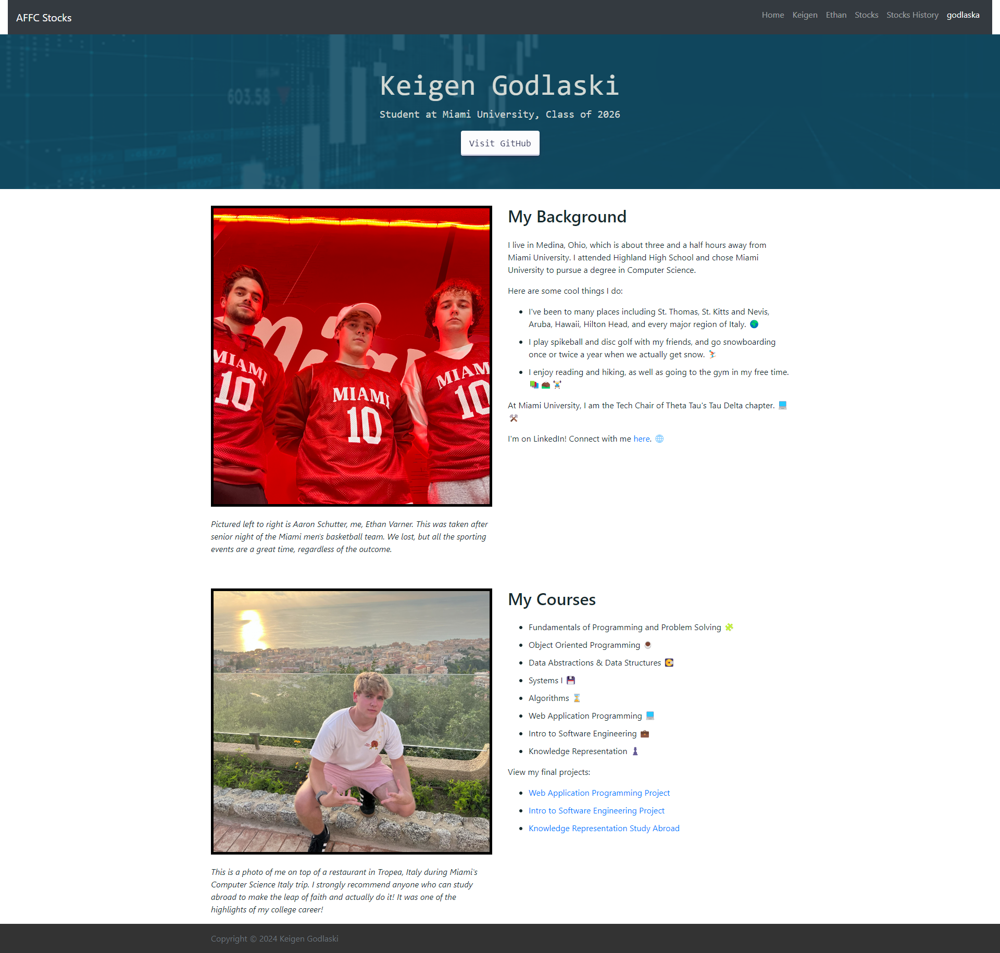
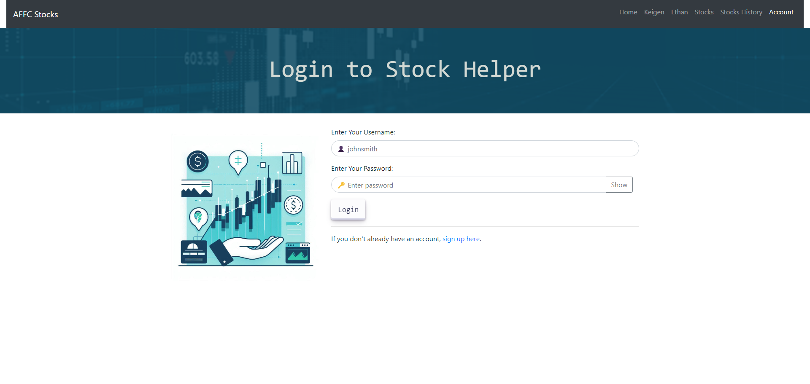
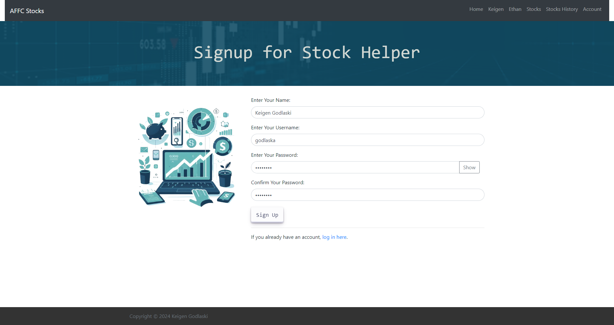
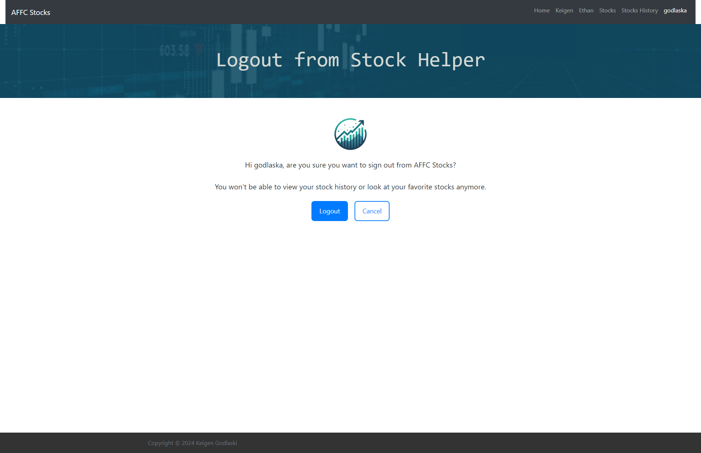
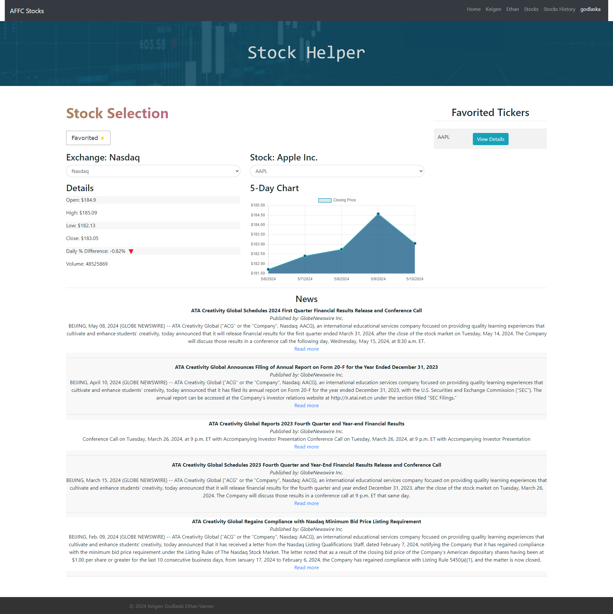
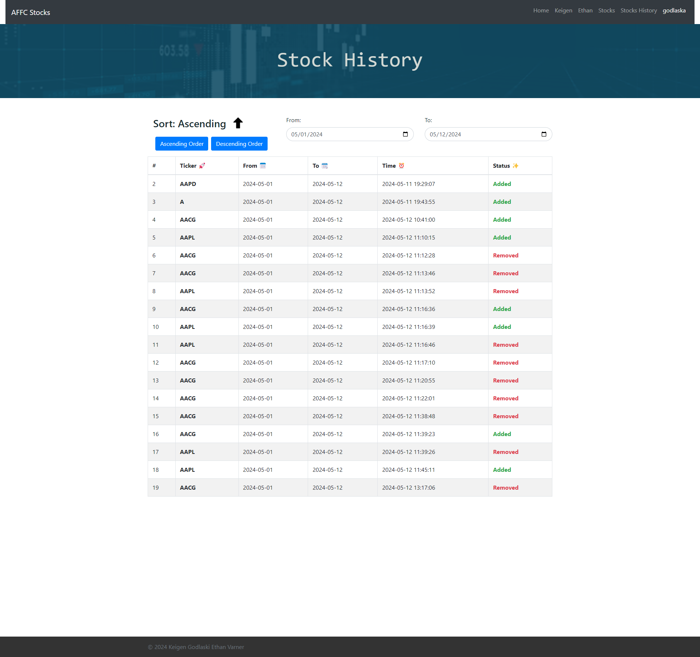

# 📈 AFFC Stocks – Stock Helper Web App

**AFFC Stocks** is a full-stack web application designed as a final project for CSE383 at Miami University. Developed collaboratively by Keigen Godlaski and Ethan Varner, this application serves as a responsive, user-friendly stock portfolio management tool that integrates real-time financial data, user authentication, and interactive charts to empower users to monitor and manage their investments efficiently.

---

## 🚀 Features

- **Dynamic Landing Page**
  - Overview of the platform and features
  - Responsive design using Bootstrap

- **User Authentication**
  - Sign-up and login system using secure PHP password hashing
  - Session management to track active users

- **Stock Selection Dashboard**
  - Browse and select stocks from the NASDAQ and other exchanges
  - View key stock details: open, high, low, close, volume, and daily change
  - Interactive 5-day chart rendered using Chart.js
  - Real-time news articles related to the selected stock

- **Favorites System**
  - Add or remove stocks from your favorite list
  - View favorited tickers in a dedicated sidebar
  - Store favorites in a backend database via AJAX

- **Stock History Tracker**
  - Log all changes to favorite stocks
  - Filter history by date range
  - Sort entries in ascending or descending order

- **About Pages**
  - Personal pages for Keigen and Ethan with backgrounds, coursework, and images

---

## 🛠️ Tech Stack

- **Frontend**: HTML5, CSS3, Bootstrap 5, JavaScript (AJAX, jQuery), Chart.js
- **Backend**: PHP (for authentication and database interactions)
- **Database**: SQLlite (used via OpenStack hosting)
- **API Integration**: Polygon.io (real-time stock data and news)

---

## 📂 File Structure

```plaintext
├── ethan.html                  # Ethan's About Me page
├── keigen.html                 # Keigen's About Me page
├── index.html                  # Landing page
├── login.html                  # Login form
├── logout.html                 # Logout confirmation page
├── signup.html                 # Sign-up form
├── stocks.html                 # Main dashboard with stock info and favorites
├── stocks_history.html         # History of favorites
├── styles.css                  # Site-wide custom styles
├── login.js                    # JavaScript for login/signup interactions
├── ticker.js                   # Handles stock info, news, chart logic
├── images.zip                  # Contains all used images
├── images-finished             # Contains finished website images
├── commit.txt                  # Contains commit history log
└── README.md                   # You're here!
```

---

## 📸 Screenshots

Here’s a preview of the AFFC Stocks web app in action:

### 🔹 Landing Page
<div align="center">
  
  <p><em>The entry point of the site, highlighting the purpose and features of the application.</em></p>
</div>

---

### 🔹 About Pages

<div align="center">
  
  <p><em>Ethan's Page – includes personal background, hobbies, coursework, and photos.</em></p>
</div>

<div align="center">
  
  <p><em>Keigen's Page – shows education background, travels, courses, and leadership role.</em></p>
</div>

---

### 🔹 Authentication

<div align="center">
  
  <p><em>Login Page – clean and intuitive interface with username/password validation.</em></p>
</div>

<div align="center">
  
  <p><em>Signup Page – sign-up form with confirm password and secure entry.</em></p>
</div>

<div align="center">
  
  <p><em>Logout Page – confirmation message before logging out.</em></p>
</div>

---

### 🔹 Stock Dashboard

<div align="center">
  
  <p><em>Search for stocks, add to favorites, view historical data, and read news articles.</em></p>
</div>

---

### 🔹 History Tracking

<div align="center">
  
  <p><em>View stock favorite/unfavorite history with date filters and sorting options.</em></p>
</div>

---

## 👥 Authors

- **Keigen Godlaski** – [GitHub Profile](https://github.com/godlaska)
- **Ethan Varner** – [GitHub Profile](https://github.com/varnereh)

---

## 📌 Note

This project was built for educational purposes as a final project submission for **CSE383: Web Application Programming** at Miami University. It focuses on secure authentication, dynamic data integration, and a responsive, user-friendly interface. This project was initially committed to a private GitLab which makes actual commit history is unavailable. See the attached commit.txt for the log.
